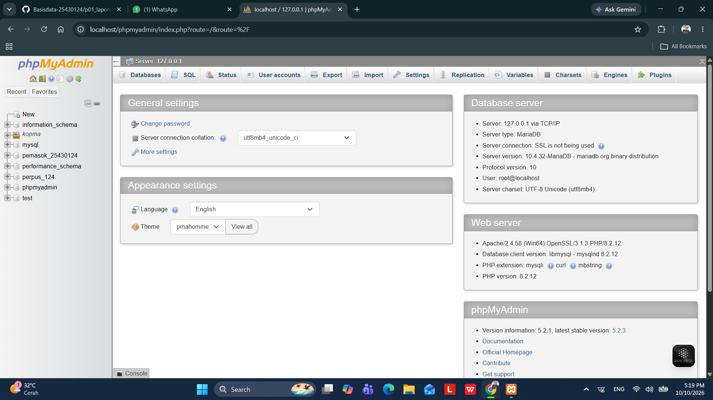

# Laporan Praktikum Basis Data - Pertemuan 01
* Nama : Daffa Bima Perdana
* NPM : 25430124
* Kelas : D
* Pertemuan Ke-01
* Tanggal Pelaksanaan : 04 Oktober 2026
* Dosen Pengampu : Dedi Irawan, S.Kom., M.T.I.
---
## 1. Tujuan Praktikum
* Menyiapkan instalasi lingkungan MariaDB dengan pengkodean utf8mb4 dan kolasi utf8mb4_unicode_ci.
* Merancang hak akses akun pengguna mhs_124 dan tamu_124 sesuai asas hak akses minimal (least privilege).
* Memverifikasi pembatasan keamanan sistem kemunculan galat 1044 dan 1142.
* Mengelola struktur berkas proyek secara terstruktur menggunakan Git dan repositori daring GitHub.
## 2. Ringkasan Dasar Teori
Manajemen hak akses pengguna merupakan fondasi keamanan basis data perpustakaan untuk mencegah modifikasi skema secara tidak sengaja maupun ancaman injeksi SQL pada portal peminjaman online. Penggunaan akun administratif root wajib dihindari untuk koneksi aplikasi harian petinggi atau staf perpustakaan. Standar karakter utf8mb4 menjamin penyimpanan data teks multibahasa (seperti judul buku asing atau nama anggota) dan simbol modern 4-byte tersimpan utuh tanpa risiko terpotong. Selain itu, mode autentikasi berbasis cookie pada antarmuka manajemen basis data dan pengaktifan SQL mode ketat menjamin konsistensi serta integritas transaksi data perpustakaan.
## 3. Langkah Percobaan
Konfigurasi awal server MariaDB dan phpMyAdmin dengan mode autentikasi cookie berhasil. Kueri SELECT VERSION(), CURRENT_USER(); memverifikasi sesi pengguna yang aktif, kueri SELECT @@sql_mode; mengonfirmasi penerapan validasi data ketat, dan SHOW DATABASES; membuktikan isolasi hak akses database pada sistem.

## 4. Titik Analisis
* Analisis 1
1. **"Label tombol bertuliskan “MySQL”, tetapi yang berjalan adalah MariaDB. Apa konsekuensinya ketika Anda mencari solusi galat di internet? Kapan dokumentasi MySQL masih relevan, dan kapan Anda harus merujuk ke dokumentasi MariaDB?"**

Konsekuensi utama dari perbedaan ini timbul karena meskipun MariaDB merupakan fork dari MySQL, keduanya telah berkembang secara independen dengan fitur dan mesin penyimpanan yang semakin berbeda.

Konsekuensi Mencari Solusi Galat di Internet

Solusi Tidak Valid atau Deprecated: Solusi atau sintaks SQL yang Anda temukan untuk MySQL versi terbaru (misalnya MySQL 8.0+) bisa jadi tidak didukung oleh versi MariaDB yang Anda gunakan, atau sebaliknya.

Variabel & Konfigurasi Berbeda: Nama variabel sistem pada my.cnf / my.ini atau lokasi parameter konfigurasi tertentu bisa berbeda antara MariaDB dan MySQL.

Pesan Galat Berbeda: Kode atau teks pesan galat (error code) yang dihasilkan MariaDB terkadang memiliki nomor atau detail yang berbeda dari MySQL, sehingga pencarian teks galat spesifik MySQL bisa jadi tidak memunculkan hasil yang tepat.

Kapan Dokumentasi MySQL Masih Relevan?

Perintah SQL Dasar (ANSI SQL): Untuk sintaks standar seperti SELECT, INSERT, UPDATE, DELETE, JOIN, serta pembuatan tabel dasar (CREATE TABLE).

Fitur & Struktur Utama yang Kompatibel: Penggunaan primary key, foreign key, indeks dasar, serta tipe data standar (VARCHAR, INT, DATETIME).

Konsep Relasional Umum: Pemahaman konsep transaksi (ACID), tingkat isolasi (isolation levels), serta logika perancangan basis data relasional.

Kapan Harus Merujuk ke Dokumentasi MariaDB?

Fitur Spesifik MariaDB: Ketika menggunakan mesin penyimpanan khas MariaDB (seperti Aria, ColumnStore, atau MyRocks) serta fungsi-fungsi khusus seperti Sequence Engine atau JSON functions versi MariaDB.

Pengaturan Akses & Keamanan: Konfigurasi hak akses, metode autentikasi pengguna (misalnya plugin unix_socket), serta variabel sistem pada file konfigurasi.

Fitur MySQL 8.0+ yang Tidak Ada/Berbeda: Fitur modern seperti Common Table Expressions (CTE), Window Functions, atau manipulasi JSON sering kali memiliki perbedaan sintaks dan implementasi antara MySQL 8.0 dan MariaDB.

Fitur Replikasi & Kluster: Pengaturan replikasi galat, Galera Cluster, serta manajemen failover yang spesifik untuk arsitektur MariaDB.
* Analisis 2
2. **"Keluar lagi, lalu coba masuk dengan mysql -u root tanpa -p. Catat pesan galat yang muncul. Bagian mana dari pesan itu yang memberi tahu bahwa klien tidak mengirim password? Bandingkan jawaban Anda dengan Gambar 1.10 di bagian Troubleshooting."**

Saat mencoba masuk ke MariaDB/MySQL menggunakan perintah mysql -u root tanpa parameter -p, pesan galat yang akan muncul adalah:

**Plaintext ERROR 1045 (28000): Access denied for user 'root'@'localhost' (using password: NO)**

Bagian dari pesan galat yang memberi tahu bahwa klien tidak mengirim password adalah teks (using password: NO).

Jika nilai pada tanda kurung tersebut bernilai NO, artinya koneksi dilakukan tanpa menyertakan password. Sebaliknya, jika Anda memasukkan password tetapi nilainya salah, pesannya akan menjadi (using password: YES).

* Analisis 3
3. **"Mengapa information_schema tetap terlihat oleh mhs_123, sedangkan mysql ditolak dengan ERROR 1044? Apa bedanya kode galat 1044 dengan 1045?"**

Mengapa information_schema Tetap Terlihat oleh mhs_123?
Basis data information_schema adalah skema standar (katalog data) bawaan MySQL/MariaDB yang berisi metadata tentang semua basis data lain, seperti nama tabel, kolom, tipe data, dan hak akses. Setiap pengguna yang berhasil login secara otomatis diberi akses read-only (baca saja) ke information_schema agar aplikasi atau pengguna dapat mengetahui struktur objek basis data yang berhak mereka akses. Pengguna tidak bisa mengubah atau menghapus isi skema ini, dan informasi yang ditampilkan di dalamnya pun dibatasi hanya untuk objek yang memang memiliki izin akses bagi pengguna tersebut.

* Perbedaan Kode Galat 1044 dan 1045 

-- ERROR 1044 (Access denied for user ... to database ...)

**Penyebab: Masalah Otorisasi (Hak Akses Basis Data).** Pengguna berhasil login (otentikasi nama dan password valid), tetapi akun tersebut tidak memiliki izin/privilese untuk mengakses atau melakukan operasi pada basis data spesifik yang diminta (misalnya basis data mysql).

-- ERROR 1045 (Access denied for user ... (using password: ...))

**Penyebab: Masalah Otentikasi (Kredensial Login).** Pengguna gagal login ke server basis data karena kombinasi nama pengguna (username), kata sandi (password), atau host asal koneksi tidak sesuai dengan daftar akun yang terdaftar.

* Analisis 4
4. **"Mode cookie meminta pengguna mengetik password setiap kali masuk. Mengapa mode ini lebih aman daripada mode config yang menyimpan password di dalam berkas
konfigurasi?"**

Mode cookie lebih aman daripada mode config karena beberapa alasan keamanan utama:

-- Sandi Tidak Tersimpan dalam Teks Polos (Plaintext)

Mode Config: Kata sandi (password) ditulis dan disimpan langsung di dalam berkas konfigurasi server (misalnya config.inc.php). Siapa pun yang memiliki akses baca ke server, berkas cadangan (backup), atau menemukan celah keamanan directory traversal dapat membaca kata sandi tersebut dengan mudah.

Mode Cookie: Kata sandi tidak pernah disimpan di dalam berkas server. Kata sandi dienkripsi dan disimpan sementara sebagai cookie di peramban (browser) pengguna selama sesi aktif.

-- Perlindungan Terhadap Akses Fisik dan Sesi Terbuka

Mode Config: Setiap orang yang membuka URL antarmuka manajemen (seperti phpMyAdmin) akan langsung masuk secara otomatis tanpa perlu login, karena server menyertakan kredensial secara otomatis.

Mode Cookie: Pengguna wajib memasukkan nama pengguna dan kata sandi setiap kali memulai sesi baru. Jika peramban ditutup atau sesi timeout, akses akan otomatis terputus sehingga mencegah orang lain menggunakan komputer yang sama untuk mengakses basis data.

-- Prinsip Least Privilege dan Akuntabilitas Multi-Pengguna

Mode Config: Biasanya mengikat seluruh antarmuka ke satu akun tunggal (sering kali akun root), sehingga semua aktivitas tercatat atas nama akun tersebut.

Mode Cookie: Mengizinkan setiap pengguna (database user) untuk masuk menggunakan akun dan hak aksesnya masing-masing, sehingga membatasi batasan akses sesuai peran dan memudahkan audit aktivitas pengguna.

## 5. Latihan
Pembuatan Akun Tamu dan Pengujian Galat 1142:

akun tamu_124 dibuat dengan batasan hanya perintah SELECT pada basis data perpus_124. Saat akun ini mencoba menjalankan perintah CREATE TABLE uji (id INT);, server MariaDB menolak eksekusi dan memunculkan galat 1142 (CREATE command denied to user 'tamu_124'@'localhost' for table 'uji').

Skrip Idempotent (E.2):

Skrip p01_lingkungan_25430124.sql dirancang agar dapat dieksekusi berulang kali tanpa menghasilkan galat duplikasi dengan menerapkan klausa CREATE DATABASE IF NOT EXISTS dan CREATE USER IF NOT EXISTS.

## 6. Tugas Mandiri : Milestone Proyek 1
Proyek yang akan dikembangkan adalah sistem basis data perpustakaan dengan skema utama perpus_124 dan akun pengembang mhs_124.
* keputusan desain
  Menggunakan set karakter utf8mb4 dengan kolasi utf8mb4_unicode_ci agar katalog buku perpustakaan dapat menampung nama produk dengan simbol khusus dan karakter multibahasa secara konsisten. Akun pengembang mhs_124 hanya diberikan hak penuh atas basis data perpus_124 untuk menjamin isolasi data terhadap basis data lainnya di dalam DBMS.
* Perintah SQL

  CREATE DATABASE IF NOT EXISTS perpus_124 CHARACTER SET utf8mb4 COLLATE utf8mb4_unicode_ci;

  CREATE USER IF NOT EXISTS 'mhs_124'@'localhost' IDENTIFIED BY 'PodoMbiyen';

  GRANT ALL PRIVILEGES ON perpus_124.* TO 'mhs_124'@'localhost'; FLUSH PRIVILEGES;
* pengujian Akses dan sql_mode

  Pengujian dilakukan dengan masuk ke sesi MariaDB menggunakan akun mhs_124, memeriksa variabel sistem dengan SELECT VERSION(), CURRENT_USER(); serta SELECT @@sql_mode;, lalu beralih ke basis data perpus_124.

  

* bukti pengujian isolasi keamanan

  pengujian dilakukan dengan:
  * Menjalankan perintah USE mysql; menggunakan akun mhs_124. Akses ditolak dan menghasilkan pesan Galat 1044 (Access denied for user 'mhs_124'@'localhost' to database 'mysql').
  * Menjalankan perintah CREATE TABLE uji (id INT); di dalam database toko_115 menggunakan akun tamu_115. Perintah ditolak dan menghasilkan pesan Galat 1142 (CREATE command denied to user 'tamu_115'@'localhost' for table 'uji').
 
    

 
    
* Struktur Berkas Proyek di VS Code

  

## 7. Pembahasan dan Kendala
terdapat galat dengan kode 1044 dan 1142 yang berhasil terpicu pada tahap pengujian. galat 1044 merupakan ketiadaan izin akses pada tingkatan basis data utuh, sedangkan galat 1142 ketiadaan izin operasional perintah spesifik terhadap tabel objek. untuk cara mengatasi kedua galat tersebut dengan cara menyesuaikan penetapan menggunakan perintah GRANT spesifik atau memastikan sesi pengguna beroperasi sesuai ruang lingkup basis data yang telah ditetapkan.
## 8. Kesimpulan
Konfigurasi MariaDB untuk proyek Sistem Informasi Perpustakaan sudah berhasil disiapkan menggunakan encoding utf8mb4 serta pembatasan akses khusus untuk akun pengembang mhs_124. Keamanan hak akses ini telah teruji secara valid lewat kemunculan pesan kesalahan 1044 dan 1142. Integrasi repositori Git lokal dan repositori pusat juga sudah terhubung dengan baik guna menunjang tahap perancangan struktur tabel pada modul mendatang.
## 9. Penggunakan AI
Pada Praktikum 01 ini AI yang digunakan untuk membantu pembuatan laporan ini adalah Gemini yang digunakan untuk sarana konsultasi skrip SQL, pembahasan secara teori mengenai perbedaan kode galat, penulisan laporan, pembuatan repositori serta pengambilan tangkapan layar sebagai bukti dijalankannya skrip pada komputer lokal.
## 10. Bukti git

Tautan Repositori : https://github.com/DaffaBimaPerdana30/Basisdata-25430124

## Checklist Laporan Praktikum (Umum)

| Butir | Yang Harus Ada | Status |
| :--- | :--- | :---: |
| Identitas | Nama, NPM, kelas, pertemuan ke-1, tanggal pelaksanaan, nama dosen/asisten | [x] |
| Tujuan | Tujuan praktikum ditulis ulang dengan bahasa sendiri (maksimal 5 baris) | [x] |
| Ringkasan teori | Pemahaman sendiri atas Dasar Teori, maksimal setengah halaman | [x] |
| Langkah percobaan (D) | Tangkapan layar hasil langkah kunci diberi keterangan singkat | [x] |
| Titik Analisis | Semua Titik Analisis dijawab lengkap dengan alasan | [x] |
| Latihan (E) | Skrip/dokumen hasil latihan beserta bukti berjalan | [x] |
| Tugas Mandiri (F) | Milestone proyek pertemuan ini: berkas, bukti, dan penjelasan keputusan desain | [x] |
| Pembahasan dan kendala | Galat yang ditemui, cara membacanya, dan cara mengatasinya | [x] |
| Kesimpulan | Dua sampai empat kalimat dengan bahasa sendiri | [x] |
| Pernyataan Penggunaan AI | Alat yang dipakai, untuk apa, bagian mana | [x] |
| Bukti Git | Tautan repositori dan kode commit (hash) | [x] |
| Keaslian | Tangkapan layar memperlihatkan akun ber-NPM dan jam sistem | [x] |

---

## Tabel 2.9 Checklist Khusus Laporan Pertemuan 2

| Jenis | Yang harus ada | Status |
| :--- | :--- | :---: |
| **Berkas wajib** | `p02_kebutuhan_data_25430115.md` (proyek) | [x] |
| **Bukti tangkapan layar** | Tabel PB, AB, KI, matriks CRUD, dan kamus data di berkas proyek (tangkapan tampilan GitHub) | [x] |
| **Analisis wajib** | Titik Analisis 1–3; perhitungan parameter P; perbaikan tiga pernyataan kebutuhan kabur | [x] |
