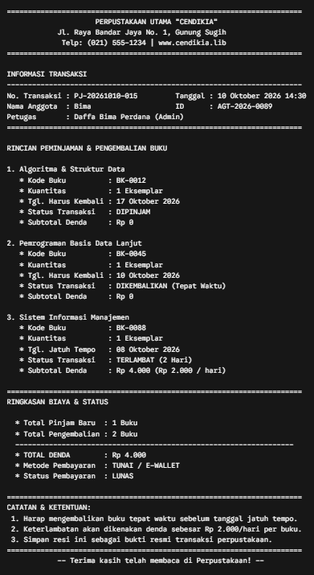

# Dokumen Kebutuhan Data Proyek: Perpustakaan
**Penyusun:** Daffa Bima Perdana

**NPM:** 25430124

**Kelas:** D  

**Mata Kuliah:** Praktikum Basis Data  

---

## 1. Profil Organisasi dan lingkup Layanan
** Sistem Pelayanan Peminjaman Buku Perpustakaan merupakan sistem informasi berbasis digital yang melayani pengelolaan bahan pustaka dan prosedur transaksi peminjaman buku. Ruang lingkup sistem mencakup pengelolaan katalog buku dan kategori, pendaftaran anggota, pemrosesan transaksi peminjaman dan pengembalian, perhitungan denda keterlambatan, serta pencatatan stok buku dan ulasan bacaan.

## 2. Proses Bisnis (PB)
* PB-01 (Registrasi dan Autentikasi Anggota): Anggota mendaftarkan akun baru dengan mengisi identitas dasar serta kontak, kemudian sistem mencatat data akun untuk kebutuhan autentikasi masuk ke platform perpustakaan.
* PB-02 (Manajemen Katalog dan Stok Buku): Admin/Pustakawan mengelola data buku, kategori/klasifikasi buku, penerbit/pengarang, dan memperbarui stok/jumlah ketersediaan buku di rak perpustakaan.
* PB-03 (Peminjaman dan Transaksi Pengajuan Buku): Anggota memilih buku yang ingin dipinjam ke dalam daftar pinjaman, menentukan durasi/tanggal peminjaman, dan membuat transaksi pengajuan peminjaman buku.
* PB-04 (Konfirmasi Pengembalian dan Pelunasan Denda): Anggota melakukan pengembalian buku atau pelunasan denda keterlambatan (jika ada), kemudian admin/sistem memvalidasi status peminjaman menjadi selesai/dikembalikan.
* PB-05 (Pengelolaan Ulasan dan Resensi Buku): Anggota yang telah menyelesaikan peminjaman dapat memberikan rating dan ulasan teks/resensi terhadap buku yang telah dibaca.

##Berikut adalah penyesuaian daftar Entitas Kandidat dari gambar agar sesuai dengan **Pelayanan pada Perpustakaan (Peminjaman Buku)**:

## 3. Entitas Kandidat (Minimal 6 Entitas)

1. **Anggota:** Menyimpan data profil pemustaka/anggota yang terdaftar di perpustakaan.
2. **Kategori:** Menyimpan klasifikasi kelompok atau subjek buku.
3. **Buku:** Menyimpan data koleksi buku, spesifikasi (penulis, penerbit, tahun terbit), dan jumlah persediaan stok eksemplar.
4. **Peminjaman:** Menyimpan header transaksi peminjaman buku oleh anggota.
5. **Detail_Peminjaman:** Menyimpan rincian item buku yang dipinjam, batas tanggal jatuh tempo, serta status pengembalian per buku.
6. **Denda:** Menyimpan catatan pelunasan atau tagihan denda keterlambatan pengembalian buku, metode bayar, dan status pembayaran.
7. **Ulasan:** Menyimpan penilaian dan ulasan buku dari anggota atas bahan pustaka yang telah dibaca.

Berikut adalah penyesuaian **Aturan Bisnis (AB)** dari gambar agar sesuai dengan **Pelayanan pada Perpustakaan (Peminjaman Buku)**:

---

### **4. Aturan Bisnis (AB) - Minimal 8 Aturan**

* **AB-01 (Keunikan Identitas Akun):** Setiap akun anggota wajib menggunakan alamat email (atau Nomor Induk Anggota) yang unik dan kata sandi disimpan dalam bentuk hash terenkripsi.
* **AB-02 (Validitas Stok dan Tarip Denda):** Jumlah sisa stok buku dan tarif denda keterlambatan per hari tidak boleh bernilai negatif (harus >= 0).
* **AB-03 (Klasifikasi Kategori):** Setiap buku wajib terhubung dengan minimal satu kategori/subjek buku yang aktif.
* **AB-04 (Pemberian Nomor Peminjaman):** Setiap transaksi peminjaman baru wajib diberikan nomor transaksi peminjaman yang unik dan otomatis tercatat tanggal/waktu pembuatannya.
* **AB-05 (Peminjaman Berbasis Ketersediaan):** Jumlah kuantitas buku dalam Detail_Peminjaman tidak boleh melebihi jumlah sisa stok buku yang tersedia di rak perpustakaan.
* **AB-06 (Otomatisasi Pemotongan Stok):** Ketika transaksi peminjaman berhasil dibuat, sistem wajib langsung mengurangi kuantitas stok buku terkait secara atomik.
* **AB-07 (Batas Waktu Pengembalian & Jatuh Tempo):** Transaksi peminjaman yang melewati tanggal jatuh tempo akan otomatis tercatat terlambat dan dikenakan tarif denda harian sesuai aturan perpustakaan.
* **AB-08 (Validasi Nominal Denda/Pelunasan):** Nominal pada entitas Denda/Pembayaran wajib bernilai sama persis dengan total kewajiban tagihan denda pada peminjaman terkait.
* **AB-09 (Syarat Ulasan Buku):** Anggota hanya diperbolehkan membuat ulasan/resensi pada buku yang status transaksi peminjamannya sudah terverifikasi selesai (*completed* / sudah dikembalikan).

Berikut adalah penyesuaian **Kebutuhan Informasi (KI)** dari gambar agar sesuai dengan **Pelayanan pada Perpustakaan (Peminjaman Buku)**:

## **5. Kebutuhan Informasi (KI) - Minimal 5 Kebutuhan**

* **KI-01 (Katalog Buku Aktif):** Menampilkan daftar judul buku, pengarang, nama kategori, dan sisa stok eksemplar yang siap dipinjam.
* **KI-02 (Riwayat Peminjaman Anggota):** Menampilkan rekap histori peminjaman per anggota lengkap dengan nomor peminjaman, tanggal pinjam, tanggal jatuh tempo, status pengembalian, dan total denda (jika ada).
* **KI-03 (Laporan Transaksi Peminjaman Harian/Bulanan):** Rekapitulasi volume transaksi peminjaman buku, tingkat pengembalian, dan total penerimaan denda dalam periode tanggal tertentu untuk kepala perpustakaan.
* **KI-04 (Peringatan Stok Buku Menipis):** Informasi daftar buku dengan persediaan stok tersedia di bawah batas ambang minimum ($\le$ 5 unit/eksemplar) agar segera dilakukan pengadaan atau penambahan koleksi.
* **KI-05 (Rata-rata Rating Buku):** Menhitung nilai rerata ulasan bintang (1-5) dan testimoni/resensi anggota pada halaman detail buku.

## 6. Matriks CRUD Lengkap

| Entitas | Registrasi Akun | Kelola Katalog | Buat Pesanan | Bayar Pesanan | Beri Ulasan | Rekap Laporan |
| :--- | :---: | :---: | :---: | :---: | :---: | :---: |
| **Pelanggan** | C, R | - | R | R | R | R |
| **Kategori** | - | C, R, U, D | R | - | - | R |
| **Buku** | - | C, R, U, D | R, U (stok) | - | R | R |
| **Peminjaman** | - | - | C, R | R, U (status) | R | R |
| **Detail_Peminjaman**| - | - | C, R | R | - | R |
| **Denda/Pembayaran** | - | - | - | C, R | - | R |
| **Ulasan** | - | - | - | - | C, R | R |

## 7. Kamus Data Awal (21 Elemen dengan Penanggung Jawab)

| No | Nama Elemen Data | Tipe Data | Keterangan / Batasan | Penanggung Jawab |
|---|---|---|---|---|
| 1 | `id_anggota` | INT | Kunci utama identitas akun anggota | Database Administrator |
| 2 | `nama_lengkap` | VARCHAR(100) | Nama anggota perpustakaan | Anggota   / Front-End Dev |
| 3 | `email_anggota` | VARCHAR(100) | Alamat email unik untuk login | anggota/ Front-End Dev |
| 4 | `kata_sandi_hash` | VARCHAR(255) | Hash kata sandi terenkripsi | Backend Developer / Security |
| 5 | `nomor_telepon` | VARCHAR(20) | Kontak aktif Anggota | anggota |
| 6 | `alamat_anggota`| TEXT | Alamat lengkap Anggota | Anggota |
| 7 | `id_kategori` | INT | Kunci utama kategori produk/klasifikasi buku | Pustakawan/Admin |
| 8 | `nama_kategori` | VARCHAR(50) | Nama kelompok/subjek buku (mis:Fiksi,Sains) | Pustakawan/Admin |
| 9 | `id_buku` | INT | Kunci utama buku | Pustakawan/Admin |
| 10 | `judul buku` | VARCHAR(150) | Judul Resmi buku koleksi perpustakaan | Pustakawan/Admin |
| 11 | `tarif_denda_per_hari` | DECIMAL(12,2) | Nilai nominal rupiah barang (>= 0) | Bagian Keuangan / Admin |
| 12 | `stok_tersedia` | INT | Biaya Harian jika terlambat (>= 0)| Pustakawan/Admin |
| 13 | `id_peminjaman` | INT | Nomor unik transaksi peminjaman | Sistem Peminjaman |
| 14 | `tanggal_peminjaman` | DATETIME | Waktu transaksi dibuat otomatis | Sistem Peminjaman |
| 15 | `total_denda` | DECIMAL(12,2) | Total nilai denda yang harus dibayar | Sistem Peminjaman |
| 16 | `status_peminjaman` | VARCHAR(20) | Nilai: 'DIPINJAM', 'DIKEMBALIKAN', 'TERLAMBAT' | Sistem / Admin |
| 17 | `jumlah_pinjam` | INT | Banyaknya unit buku yang dipinjam (> 0)| anggota |
| 18 | `tanggal_jatuh_tempo` | DECIMAL(12,2) | Batas maksimal waktu pengembalian buku | Sistem Peminjaman |
| 19 | `id_pembayaran_denda` | INT | Kunci unik catatan pelunasan denda | Staf Keuangan |
| 20 | `metode_bayar` | VARCHAR(50) | Pilihan: 'TUNAI', 'E_WALLET', 'TRANSFER_BANK' | Anggota |
| 21 | `nilai_rating` | INT | Bintang ulasan bernilai skala 1 hingga 5 | Anggota |

Berikut adalah penyesuaian **Kebutuhan Non-Fungsional dan Perlindungan Data Pribadi** dari gambar agar sesuai dengan **Pelayanan pada Perpustakaan (Peminjaman Buku)**:

## **8. Kebutuhan Non-Fungsional dan Perlindungan Data Pribadi**

### **1. Perlindungan Data Pribadi (Privasi):**

* Data sensitif seperti `kata_sandi_hash`, `nomor_telepon`, dan `alamat_anggota` diklasifikasikan sebagai data pribadi rahasia.

* Kata sandi wajib di-*hash* menggunakan algoritma modern dan dilarang disimpan dalam bentuk teks polos (*plain text*).

* Hak akses melihat nomor telepon dan alamat fisik hanya dibuka bagi Anggota pemilik akun dan Pustakawan/Admin perpustakaan dengan otorisasi berbasis peran (*Role-Based Access Control*).

### **2. Ketersediaan & Keandalan (*Availability & Reliability*):**

* Sistem mampu beroperasi 24/7 dengan batas toleransi pemulihan kegagalan (*recovery*) maksimal 15 menit.

* Transaksi pencatatan peminjaman dan pemotongan stok eksemplar buku wajib mematuhi standar ACID untuk menghindari selisih stok (*race condition*).

### **3. Performa (*Performance*):**

* Pemuatan katalog buku dan kueri pencarian wajib selesai dalam waktu $\le$ 500 milidetik pada penggunaan normal.

## 9. Bedah Dokumen Sumber Fiktif : Nota Peminjaman

Rancangan Dokumen Nota Fiktif

======================================================================
                     PERPUSTAKAAN UTAMA "CENDIKIA"
            Jl. Raya Bandar Jaya No. 1, Gunung Sugih
             Telp: (021) 555-1234 | www.cendikia.lib
======================================================================

INFORMASI TRANSAKSI
----------------------------------------------------------------------
No. Transaksi : PJ-20261010-015         Tanggal : 10 Oktober 2026 14:30
Nama Anggota  : Bima                    ID      : AGT-2026-0089
Petugas       : Daffa Bima Perdana (Admin)
======================================================================

RINCIAN PEMINJAMAN & PENGEMBALIAN BUKU

1. Algoritma & Struktur Data
   * Kode Buku          : BK-0012
   * Kuantitas          : 1 Eksemplar
   * Tgl. Harus Kembali : 17 Oktober 2026
   * Status Transaksi   : DIPINJAM
   * Subtotal Denda     : Rp 0

2. Pemrograman Basis Data Lanjut
   * Kode Buku          : BK-0045
   * Kuantitas          : 1 Eksemplar
   * Tgl. Harus Kembali : 10 Oktober 2026
   * Status Transaksi   : DIKEMBALIKAN (Tepat Waktu)
   * Subtotal Denda     : Rp 0

3. Sistem Informasi Manajemen
   * Kode Buku          : BK-0088
   * Kuantitas          : 1 Eksemplar
   * Tgl. Jatuh Tempo   : 08 Oktober 2026
   * Status Transaksi   : TERLAMBAT (2 Hari)
   * Subtotal Denda     : Rp 4.000 (Rp 2.000 / hari)

======================================================================
RINGKASAN BIAYA & STATUS

  * Total Pinjam Baru  : 1 Buku
  * Total Pengembalian : 2 Buku
  ------------------------------------------------------------------
  * TOTAL DENDA        : Rp 4.000
  * Metode Pembayaran  : TUNAI / E-WALLET
  * Status Pembayaran  : LUNAS

======================================================================
CATATAN & KETENTUAN:
 1. Harap mengembalikan buku tepat waktu sebelum tanggal jatuh tempo.
 2. Keterlambatan akan dikenakan denda sebesar Rp 2.000/hari per buku.
 3. Simpan resi ini sebagai bukti resmi transaksi perpustakaan.
======================================================================
            -- Terima kasih telah membaca di Perpustakaan! --
