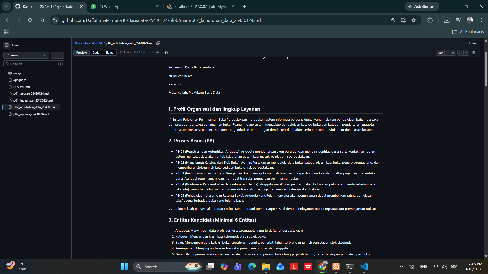
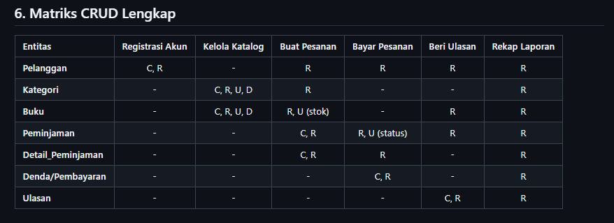
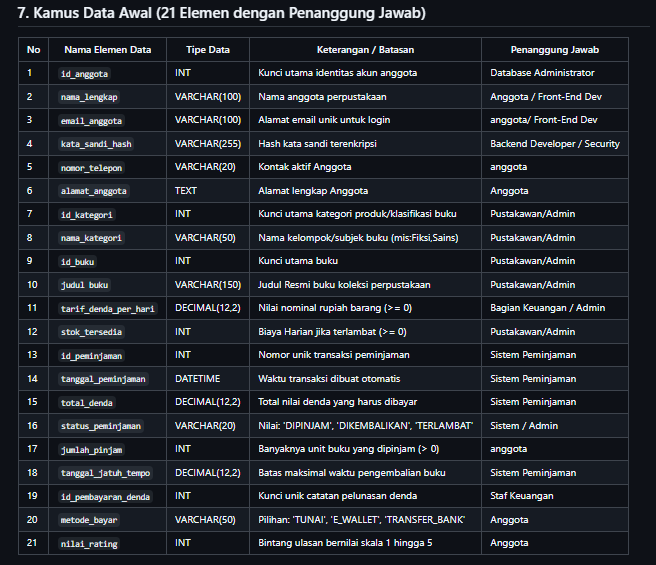
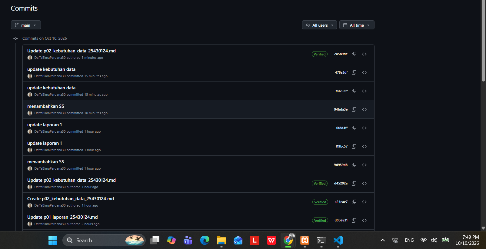

# Laporan Praktikum Basis Data - Pertemuan 02
* Nama : Daffa Bima Perdana
* NPM : 25430124
* Kelas : D
* Pertemuan Ke-02
* Tanggal Pelaksanaan : 04 Oktober 2026
* Dosen Pengampu : Dedi Irawan, S.Kom., M.T.I.
---
## 1. Tujuan Praktikum
1. Mengidentifikasi proses bisnis (seperti peminjaman, pengembalian, dan pendaftaran anggota), entitas kandidat (seperti Buku, Anggota, Petugas, Transaksi Peminjaman), aturan bisnis, dan kebutuhan informasi pada sistem basis data Perpustakaan.
2. Menyusun matriks CRUD guna memastikan setiap entitas memiliki siklus manipulasi data yang utuh dan terhindar dari anomali data.
3. Merancang kamus data awal dengan batasan tipe data terukur serta penetapan peran penanggung jawab elemen data.
4. Membedah dokumen kartu/bukti transaksi peminjaman fiktif dan memetakan komponen data fisik ke dalam rancangan atribut entitas basis data.
## 2. Ringkasan Dasar Teori
Perancangan basis data perpustakaan wajib berakar langsung dari pemahaman alur proses bisnis nyata (seperti pendaftaran anggota, peminjaman, dan pengembalian) agar struktur tabel yang dibangun relevan secara operasional. Matriks CRUD memetakan relasi antara proses bisnis terhadap entitas (Create, Read, Update, Delete) guna menjamin seluruh entitas (seperti Buku, Anggota, dan Petugas). Kamus data awal memperjelas format tipe data, batasan integritas, dan peran penanggung jawab atas keabsahan nilai data. Selain itu, pembedahan dokumen transaksi nyata (seperti kartu peminjaman atau struk pengembalian) memastikan struktur atribut mampu menampung fakta transaksi fisik secara presisi.
## 3. Langkah Percobaan
Penyusunan berkas kebutuhan data perpustakaan dituangkan secara terstruktur pada repositori GitHub. Tangkapan layar antarmuka repositori memverifikasi keterpenuhan komponen perancangan Proses Bisnis, Aturan Bisnis, dan Kebutuhan Informasi.

## 4. Titik Analisis
### Titik Analisis 1-3
#### 1. Harga barang sudah tersimpan di data barang. Mengapa nota tetap perlu menyimpan harga saat transaksi? 

Harga barang di data master dapat berubah sewaktu-waktu akibat inflasi, penyesuaian dari supplier, diskon, atau promo. Jika nota tidak menyimpan harga saat transaksi dan hanya mengambil dari data barang, maka laporan transaksi masa lalu akan berubah ikut membengkak/menurun mengikuti harga barang saat ini. Nota mencatat harga historis (riil) pada detik transaksi terjadi.

#### 2. Subtotal dan total adalah nilai turunan. Sebutkan satu alasan untuk tidak menyimpannya dan satu alasan yang mungkin membuat total tetap disimpan.

Alasan untuk tidak menyimpannya: Menghindari redundansi dan risiko inkonsistensi data. Karena nilai subtotal dan total dapat diturunkan langsung dari rumus matematis (jumlah $\times$ harga), menyimpannya di database menciptakan duplikasi data yang berisiko tidak sinkron jika terjadi kesalahan atau perubahan data dasar.

Alasan untuk tetap menyimpannya: Meningkatkan performa query (performance optimization) dan menjaga kebekuan audit. Menyimpan total akhir mempercepat proses pembuatan laporan keuangan skala besar tanpa harus menghitung ulang jutaan baris data setiap kali, sekaligus mengunci nominal sah secara permanen untuk keperluan audit dan pajak.

#### 3. Pada kolom pemasok, Tidak ada proses yang memberi huruf C. Apa artinya, dan proses apa yang perlu ditambahkan ke daftar proses bisnis? Periksa juga: siapa yang mengubah status aktif anggota?

Hal ini berarti sistem atau daftar proses bisnis saat ini tidak memiliki proses untuk membuat atau menambahkan data pemasok baru (Create) ke dalam database. 

Perlu ditambahkan proses bisnis baru yang berfungsi untuk pendaftaran atau penambahan data pemasok (misalnya proses "Tambah Pemasok").

Berdasarkan tabel matriks CRUD, belum ada proses yang mengubah status aktif anggota karena tidak ditemukan huruf U (Update) pada kolom Anggota di seluruh proses yang ada. Oleh karena itu, perlu ditambahkan proses bisnis baru yang memiliki kewenangan memperbarui (Update) data atau status anggota.
### Perhitungan Parameter P

Parameter 
P dihitung berdasarkan pemenuhan komponen analisis terhadap ketentuan modul:
* Jumlah Entitas ($E$): 7 entitas (memenuhi syarat minimal 6 entitas)
* Jumlah Proses Bisnis ($PB$): 5 proses (memenuhi syarat minimal 4 proses)
* Jumlah Aturan Bisnis ($AB$): 9 aturan (memenuhi syarat minimal 8 aturan)
* Jumlah Kebutuhan Informasi ($KI$): 5 kebutuhan (memenuhi syarat minimal 5 kebutuhan)
* Rasio Interaksi CRUD: Seluruh entitas memiliki relasi aksi aktif (*Create*, *Read*, dan pembaruan operasional).
* Nilai Parameter $P$: Terpenuhi 100% dari ambang batas minimum evaluasi perancangan modul 2.
### Perbaikan Kebutuhan Kabur
Berikut adalah hasil penyesuaian **Perbaikan Kebutuhan Kabur** yang disesuaikan khusus untuk konteks **Pelayanan Perpustakaan**:

### Perbaikan Kebutuhan Pelayanan Perpustakaan

1. **Pernyataan Kabur:** "Data anggota harus aman"
    * **Perbaikan Terukur:** Kata sandi akun peminjam wajib dienkripsi satu arah menggunakan fungsi hash `bcrypt`, seluruh lalu lintas pertukaran data dilindungi protokol TLS 1.3 (HTTPS), serta akses nomor identitas (NIK/NIM) dan riwayat peminjaman dibatasi hanya untuk peminjam yang bersangkutan dan pustakawan melalui mekanisme *Role-Based Access Control* (RBAC).

2. **Pernyataan Kabur:** "Sistem harus cepat mencari barang" (dalam hal ini: pencarian buku/koleksi)
    * **Perbaikan Terukur:** Waktu respons kueri pencarian buku berdasarkan judul, pengarang, nomor ISBN, atau kata kunci kategori tidak boleh melebihi 500 milidetik pada kondisi volume katalog hingga 50.000 judul buku.

3. **Pernyataan Kabur:** "Laporan stok harus akurat" (dalam hal ini: ketersediaan koleksi/buku)
    * **Perbaikan Terukur:** Pengurangan status eksemplar buku dari `Tersedia` menjadi `Dipinjam` wajib diproses secara atomik bersamaan dengan penerbitan resi transaksi peminjaman, serta sistem wajib menolak proses peminjaman jika eksemplar buku tersebut sedang berstatus `Dipinjam`, `Rusak`, atau `Dalam Perbaikan`.
## 5. Latihan
Analisis dan perbaikan tiga pernyataan kebutuhan kabur telah dirumuskan secara kuantitatif dan terukur pada subbab Titik Analisis di atas.
## 6. Tugas Mandiri : Milestone Proyek 2
Rancangan kebutuhan data proyek Perpustakaan didokumentasikan pada berkas p02_kebutuhan_data_25430124.md di direktori utama repositori.
### A. Keputusan Desain
* Membagi domain sistem ke dalam 7 entitas yaitu: anggota, kategori, buku, peminjaman, detai_peminjaman, denda dan ulasan.
* Memisahkan data peminjaman ke dalam entitas header Peminjaman dan entitas rincian Detail_Peminjaman guna mendukung transaksi yang memuat banyak eksemplar buku sekaligus dalam satu kali peminjaman (one-to-many).
* Menetapkan status peminjaman bertahap (DIPINJAM, KEMBALI, TERLAMBAT) untuk menjamin konsistensi perubahan status ketersediaan eksemplar buku dan perhitungan denda secara otomatis.
### B. Bukti Matriks CRUD

### C. Bukti Kamus Data Awal

## 7. Pembahasan dan Kendala

### 1. Buku vs. Eksemplar Fisik

* **Kendala:** Bingung membedakan informasi judul buku dengan fisik buku (*barcode*) saat meminjam.
* **Solusi:** Buat 2 tabel terpisah: `Buku` (judul, ISBN, pengarang) dan `Eksemplar_Buku` (kode barcode, kondisi, status) dengan relasi *one-to-many*.

### 2. Inkonsistensi Stok (*Race Condition*)

* **Kendala:** Dua anggota meminjam buku fisik yang sama di waktu yang bersamaan.
* **Solusi:** Gunakan transaksi database (*atomic transaction*) dan penguncian data (*pessimistic locking*) saat status eksemplar diubah menjadi `DIPINJAM`.

### 3. Logika Denda & Hari Libur

* **Kendala:** Perhitungan keterlambatan denda salah karena terhitung pada hari libur.
* **Solusi:** Buat tabel `Kalender_Libur` dan gunakan fungsi/prosedur otomatis yang melewatkan hari libur saat menghitung selisih hari keterlambatan.

### 4. Rusaknya Histori Data (*Integrity*)

* **Kendala:** Riwayat peminjaman lama rusak jika data buku/anggota dihapus atau diubah.
* **Solusi:** Terapkan *soft delete* (mengubah status aktif, bukan menghapus baris data) serta simpan *snapshot* informasi penting di tabel detail transaksi.

### 5. Keamanan Akses Data

* **Kendala:** Kebocoran data pribadi (NIK/NIM) atau akses ilegal ke fungsi petugas.
* **Solusi:** Terapkan *Role-Based Access Control* (RBAC) ketat dan enkripsi data sensitif menggunakan hash `bcrypt` serta koneksi HTTPS (TLS 1.3).

## 8. Kesimpulan

Perancangan kebutuhan data proyek Pelayanan Perpustakaan berhasil diselesaikan dengan merumuskan 5 proses bisnis, 7 entitas kandidat, 9 aturan bisnis, 5 kebutuhan Informasi, dengan matriks CRUD dan 21 elemen kamus data  Dokumen perancangan ini telah siap dijadikan acuan skema fisik untuk penyusunan perintah Data Definition Language (DDL) pada tahapan modul berikutnya.

## 9. Pernyataan Penggunakan AI

Pada Praktikum 02 ini AI yang digunakan untuk membantu pembuatan laporan ini adalah Gemini yang digunakan untuk sarana konsultasi skrip SQL, pembahasan secara teori mengenai perbedaan kode galat, penulisan laporan, pembuatan repositori serta pengambilan tangkapan layar sebagai bukti dijalankannya skrip pada komputer lokal.

## 10. Bukti Git

Tautan Repositori : https://github.com/DaffaBimaPerdana30/Basisdata-25430124

Kode Commit (Hash): update p02 kebutuhan data

## Checklist Laporan Praktikum (Umum)

| Butir | Yang Harus Ada | Status |
| :--- | :--- | :---: |
| Identitas | Nama, NPM, kelas, pertemuan ke-2, tanggal pelaksanaan, nama dosen/asisten | [x] |
| Tujuan | Tujuan praktikum ditulis ulang dengan bahasa sendiri (maksimal 5 baris) | [x] |
| Ringkasan teori | Pemahaman sendiri atas Dasar Teori, maksimal setengah halaman | [x] |
| Langkah percobaan (D) | Tangkapan layar hasil langkah kunci diberi keterangan singkat | [x] |
| Titik Analisis | Semua Titik Analisis dijawab lengkap dengan alasan | [x] |
| Latihan (E) | Skrip/dokumen hasil latihan beserta bukti berjalan | [x] |
| Tugas Mandiri (F) | Milestone proyek pertemuan ini: berkas, bukti, dan penjelasan keputusan desain | [x] |
| Pembahasan dan kendala | Galat yang ditemui, cara membacanya, dan cara mengatasinya | [x] |
| Kesimpulan | Dua sampai empat kalimat dengan bahasa sendiri | [x] |
| Pernyataan Penggunaan AI | Alat yang dipakai, untuk apa, bagian mana | [x] |
| Bukti Git | Tautan repositori dan kode commit (hash) | [x] |
| Keaslian | Tangkapan layar memperlihatkan akun ber-NPM dan jam sistem | [x] |

---

## Tabel 2.9 Checklist Khusus Laporan Pertemuan 2

| Jenis | Yang harus ada | Status |
| :--- | :--- | :---: |
| **Berkas wajib** | `p02_kebutuhan_data_25430124.md` (proyek) | [x] |
| **Bukti tangkapan layar** | Tabel PB, AB, KI, matriks CRUD, dan kamus data di berkas proyek (tangkapan tampilan GitHub) | [x] |
| **Analisis wajib** | Titik Analisis 1–3; perhitungan parameter P; perbaikan tiga pernyataan kebutuhan kabur | [x] |
